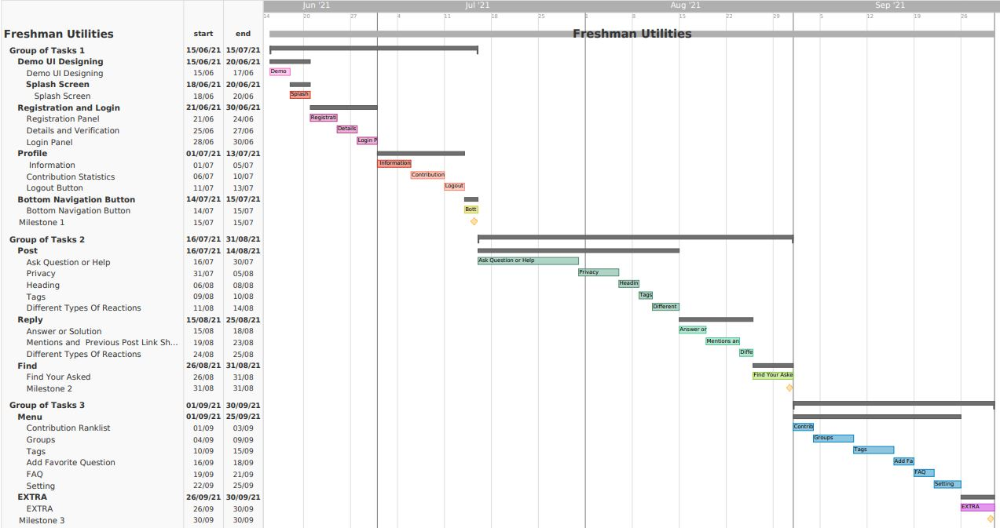

# G17-Freshman-Utilites

## Expected Timeline <!--Ataullha-->

## Feature Description <!--Ataullha-->
* **splash screen:**  A splash screen will appear while the program is launching.
* **Registration Panel :** By using university mail,department name,registration number one can register.
* **Details and Verification:** User have to give some details *not editable* and it will verify through e-mail
* **Login Panel:** Login Section for Registered users.
* **Information:** Few *Editable* Login Panel information i.e. mobile no , address and others.
* **Contribution Statistics:**  Upvote <strike>and Downvote</strike> information based in post.
* **Logout Button:** Logout...
* **Bottom Navigation Button:** users can go to different screens of application through that.
* **Ask Question or Help:** *Main Feature* - user can ask their questions and problems for solution in different category.
* **Privacy:** department , batch  types of privacy for audiance.
* **Tags:** different types of tags for post
* **Answer or Solution:** users can ask their problems and questions for solution.
* **Image/Video Posting:** User Can use this as social media also by sharing photos and videos
* **Map Route From Varsity to Current User Location:** google direction api (route)
* **FAQ** : FAQ questions for freshers added
* **Share, Download, Copy and Delete:** download, copy and can share post link section.
* **Different Types Of Reactions:** upvote for *comments* and *posts*.
* **Contact List:** All Dept. Faculty Contact infos
* **Contribution History:** History of different post and questions
* **Add Favorite Question:** users can save their favourtive or helpful post for future.
* **Setting:** , account delition :warning:.
* *Extra:* based on demand.

Report on Learning Pre-requisites <!--Ataullha-->
----------------------------------

SL | Learning Task | Description | Status | Comment |
--:|:--------------|:------------|:------:|---------|
1  | Android Basics    | Basics of Android XML, JAVA Language |   ||
2  | Android Basic Multiscreen Apps    | Intent and Different Types of Views (i.e. Adapter View ) , Fragments |   ||
3  | Android Basic Designing    | Basic UI/UX Design , Android Material Designing |   |2018331045|
4  | Android Basic Data Storage    | Basics of Firebase | ||
5  | Android Basic API  | Different Types Of APIs (i.e. Direction API and Website Parsing)  |  |2018331081|

Used Technologies
---
<ul>
 <li>Android Studio, Netbeans</li>
 <li>Java</li>
 <li>XML</li>
 <li>Firebase, TextFile</li>
 <li>Direction API</li>
 </ul>
 
List of Functionalities
---
- **Implemented features**

:heavy_check_mark: **Splash Screen :** Designe by Canva not copied from any source
 
:heavy_check_mark: **Signup** with Email(Checked with RegEx) and Password(8th Char Min. ) (Show Password, Error and User Friendly UI Avaiable)
 
:heavy_check_mark: **Email Verification :** Send Customised Verification Email From Firebase With *Resend* Facility
 
:heavy_check_mark: **Create Profile :** Profile Picture, Name, Batch(Spineer), Mobile No(Spineer), Blood Group(Spineer), Social Media Link
 
:heavy_check_mark: **Update Profile :** User Can Update and delete their photo and can edit their information
 
:heavy_check_mark: **Profile(Fragment 1) :** Profile Picture, Dept, Batch, Mobile No, Blood Group and Social Media Link
 
:heavy_check_mark: **History :** History of your asked question consist of Ask question's 4 parts
 
:heavy_check_mark: **Bottom Menu :** Logout,Delete Option(delete profile info), Share Apk(link), Report(Send report with Email Intent with Picture Attachment )
 
:heavy_check_mark: **Logout :** Forgot Password Section Also Added
 
:heavy_check_mark: **Ask Qusetions :** Ask varsity related questions, topic wise residential questions,dept wise question,batchwise question
 
:heavy_check_mark: **Upvote :** upvote answers
 
:heavy_check_mark: **Favourite Question :** Marking important questions as favourites so that they can be find easily
 
:heavy_check_mark: **Contacts:(Start Of Fargment 3) :** All Department(27 Department) Teachers Contact Information with Designation, Name, Mobile Number(DIAL_INTENT) and Email Address
                                Parse From https://www.sust.edu with Jsoup and Text File (which can be updated or modified really fast)
  
:heavy_check_mark: **FAQ :** FAQ for freshman
 
:heavy_check_mark: **Tools :** SUST Web and Library Web Webview
 
:heavy_check_mark: **Upload Video/Image :** Upload Video and Image as post and create post with description/caption
 
:heavy_check_mark:**Comment** Comment of your post
 
:heavy_check_mark: **More options in post** delete,share,copy,download post
 

- **Unimplemented features**  

✖️ **Location :** Location of Your Current GPS Location to SUST with google Directions API (not working because of billing issue)  
✖️ **Instant Help Notifications Sender :**  
✖️ **photo commenting :**  

Contribution
---
**2018331045** - 
<pre>
- Ui improvement
- History
- Share option
- Ask questions
- Reply, Favourite questions,Displaying time
- Dept wise and Batchwise Question Asking
- Post Comment and react comments
- More option of post (Download,Share,Copy url,Delete)

</pre>
 
 

**2018331081** -
<pre>
- Splash Screen,
- Singup,
- Email Verification,
- Create Profile,
- Update Profile,
- Profile(Fragment 1),
- Bottom Menu(Send Report with Screenshot),
- Contacts of All Department(27 Department) Parse From https://www.sust.edu with Jsoup,
- FAQ, 
- Tools(SUST Web and Library Web Webview),
- Upload Video/Image
</pre>
## Acknowledgement <!--Ataullha-->

 <h3>PERSON</h3>
 
 <h4> Special Thanks to:</h4>
 
  * <b> Enamul Hassan  
  Assistant Professor, 
  CSE, SUST</b>
  - [x] **For Everthing** specially prioviding valuable feedbacks and amazing ideas regarding the development of this project
   
  <h4> Others: </h4>
   
  * **Anisul Islam**  
    https://www.youtube.com/c/anisulislamrubel/channels  
  - [x] For Amazing Android Developement Playlist in Youtube
  * **Technical Skills**  
  - [x] For Saving Some Valuable Time

 <h3>PLATFORM</h3>
 
 * *StackOverflow*
 - [x] For their Developer community 
 
 * *GitHub*
 - [x] For their amazing platform and providing other valuable open source projects as our guideline 
 
 * *Google*
 - [x] For Firebase (Firestore and Realtime Database) and Directions API (though it should free for student) and also for Android Studio <strike>In My 4GB Ram Laptop</strike>

  <h5> OTHERS </h5>
  
 * https://www.sust.edu
  - [x] For a complicated website for parsing Teachers Contact Informations
 * akexorcist/GoogleDirectionLibrary
  - [x] For google direction API Library
 * JSOUP Library 
  - [x] Raw HTML Parsing Library From SUST Website
 * Apache Netbeans 
  - [x] For their Platform 
 * Freepik
  - [x] For Beautiful Background Images
 * Canva
  - [x] For Splash Screen and Icon (Not Copied From There)
 * And Many Others GitHub REpos, StackOverflow Blogs and Yotubers

## Developers <!--Ataullha-->
<table>
<tbody>
  <tr>
    <td>
<b>Group Number:</b>
    </td>
    <td>
      <b>17</b>
  </d>
  </tr>
  <tr>
    <td>
<b>Group Name  : </b>
    </td>
    <td>
      <b> Team Marshmallow</b>
    </td>
  </tr>
  <tr>
    <td colspan="2">
<b>Group member Details  :</b>
    </td>
  </tr>
  <tr>
    <td>
<pre>
Name               : <b>MD.ATAULLHA</b>
Cell               : 01879093418   
Email              : saimsaimsaimsaim7246@gmail.com,
                     ataullha81@student.sust.edu
Registration Number: <b>2018331081</b>
Session            : 2018-19,
                     CSE, SUST
</pre>
    </td>
    <td>
<pre>
Name               : <b>Soumik Paul Jisun</b>
Cell               : 01742332335
Email              : soumikpaul240499@gmail.com
Registration Number: <b>2018331045</b>
Session            : 2018-19,
                     CSE, SUST
 </pre>
</td>    
  </tr>
  </tbody>
  </table>
   
<small>&copy; 2021 - Dept. of CSE, SUST, BD</small>
